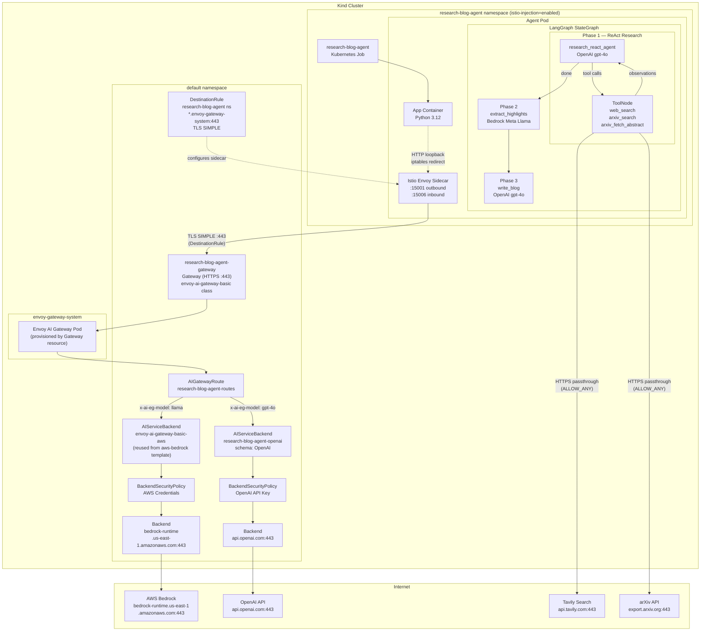
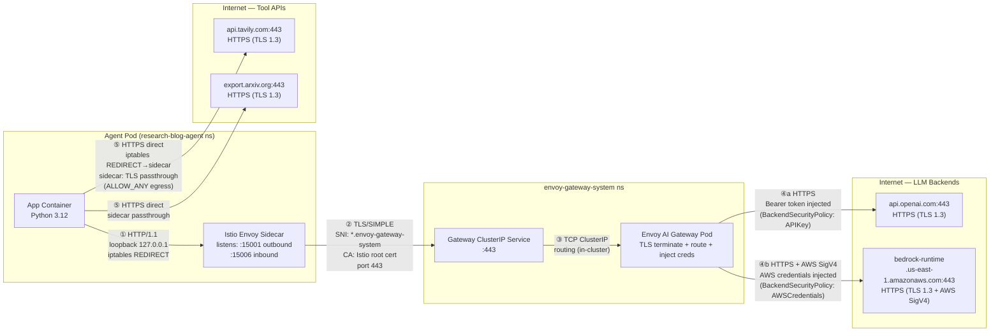
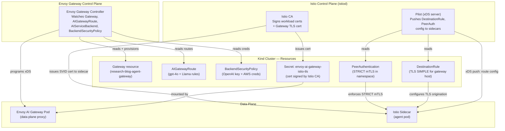

# Research Blog Agent — Multi-Model Multi-Agent Specification

## Overview

This spec describes a multi-agent LangGraph application that accepts a user-provided topic, performs live internet research using web search (Tavily) and arXiv paper retrieval, extracts key highlights using AWS Bedrock (Meta Llama), and produces a polished short blog post using OpenAI (gpt-4o). The research phase runs as a ReAct tool-calling loop also driven by gpt-4o. All LLM inference is routed through a **dedicated Envoy AI Gateway** provisioned exclusively for this agent. The agent runs in its own Kubernetes namespace (`research-blog-agent`) with Istio mTLS injection enabled. Tool API calls (Tavily, arXiv) go directly from the pod to the internet via the Istio sidecar in passthrough mode.

## Requirement Description

Build a multi-agent Python application that:
- Takes a research topic as input via `RESEARCH_TOPIC` environment variable at Job creation time
- Runs a ReAct research agent (gpt-4o + tools) that performs live web searches and fetches arXiv academic papers
- Extracts 5–7 key highlights from the gathered research using AWS Bedrock Meta Llama
- Produces a polished 500–800 word blog post with inline source citations using OpenAI gpt-4o
- Outputs the final blog to pod stdout (readable via `kubectl logs`)
- Deploys as a Kubernetes Job in the `research-blog-agent` namespace with Istio sidecar injection, following the same Istio + dedicated-gateway pattern as the `guardrails-agent`

**Non-goals:**
- Anthropic/Claude models are explicitly excluded from this agent
- Persistent storage of blog output
- Interactive topic input (topic is fixed at Job creation)
- Rate limiting (can be added later via the existing `BackendTrafficPolicy` pattern)
- PDF full-text extraction from arXiv papers (abstract + metadata only)

## Introduction

The existing agents in this platform (`first-agent`, `fallback-agent`) rely on LLM parametric knowledge to answer questions. For a research-and-blog use case, parametric knowledge has a hard cutoff date and cannot cite real sources. This agent addresses that gap by incorporating live data retrieval into the LangGraph pipeline.

The agent is deployed in its own Istio-injected namespace with a dedicated Envoy AI Gateway, isolating its traffic from other agents. This mirrors the `guardrails-agent` deployment pattern and provides a clean separation of gateway resources, credentials, and network policies per agent.

Two LLM providers are used: **OpenAI gpt-4o** handles the tool-calling research loop and final blog writing (where response quality and native tool-calling support matter most), and **AWS Bedrock Meta Llama** handles the highlights extraction step. gpt-4o tool calling works natively through the gateway in OpenAI format with no protocol translation; Llama requires translation from OpenAI format to the AWS Bedrock Invoke API.

arXiv is chosen for academic paper retrieval because it has a free, unauthenticated public API (`export.arxiv.org`), covers most fields of computer science and ML, and the `arxiv` Python library provides clean programmatic access without rate-limit concerns.

## Solution

### Architecture

Three sequential LangGraph phases share a common `BlogState`. Phase 1 is a prebuilt ReAct agent (`langgraph.prebuilt.create_react_agent`) that loops until gpt-4o stops invoking tools. Phases 2 and 3 are single-shot LLM calls. All LLM traffic flows through the dedicated `research-blog-agent-gateway`; tool API calls exit the cluster directly via the Istio sidecar.



#### Data Flow Diagram

```mermaid
sequenceDiagram
    participant Job as K8s Job\n(research-blog-agent ns)
    participant App as App Container
    participant Sidecar as Istio Sidecar\n(same pod)
    participant GW as Envoy AI Gateway\n(research-blog-agent-gateway)
    participant GPT as OpenAI gpt-4o
    participant Tavily as Tavily API
    participant ArXiv as arXiv API
    participant Llama as AWS Bedrock\nMeta Llama

    Job->>App: Start; RESEARCH_TOPIC from env

    Note over App,GPT: Phase 1 — ReAct Research Loop (max 8 iterations)

    loop Until gpt-4o stops calling tools
        App->>Sidecar: HTTP POST /v1/chat/completions\n(iptables intercept, port 15001)
        Sidecar->>GW: TLS SIMPLE — POST /v1/chat/completions\nx-ai-eg-model: gpt-4o
        GW->>GPT: HTTPS — POST /v1/chat/completions\nAuthorization: Bearer <injected key>
        GPT-->>GW: tool_call OR final text
        GW-->>Sidecar: response
        Sidecar-->>App: response (iptables return path)

        alt tool_call: web_search
            App->>Sidecar: HTTPS api.tavily.com (iptables intercept)
            Sidecar->>Tavily: HTTPS passthrough (ALLOW_ANY egress)
            Tavily-->>Sidecar: results JSON
            Sidecar-->>App: results (passthrough return)
        else tool_call: arxiv_search / arxiv_fetch_abstract
            App->>Sidecar: HTTPS export.arxiv.org (iptables intercept)
            Sidecar->>ArXiv: HTTPS passthrough (ALLOW_ANY egress)
            ArXiv-->>Sidecar: Atom XML
            Sidecar-->>App: parsed paper data
        end
    end

    Note over App: research_notes compiled from all tool outputs

    Note over App,Llama: Phase 2 — Highlights Extraction

    App->>Sidecar: HTTP POST /v1/chat/completions\nx-ai-eg-model: us.meta.llama3-3-70b-instruct-v1:0
    Sidecar->>GW: TLS SIMPLE — POST /v1/chat/completions
    GW->>Llama: HTTPS — POST /model/invoke\n(OpenAI→Bedrock translation)\nAWS SigV4 auth injected
    Llama-->>GW: numbered highlights list
    GW-->>App: highlights stored in state

    Note over App,GPT: Phase 3 — Blog Writing

    App->>Sidecar: HTTP POST /v1/chat/completions\nx-ai-eg-model: gpt-4o
    Sidecar->>GW: TLS SIMPLE — POST /v1/chat/completions
    GW->>GPT: HTTPS — POST /v1/chat/completions\n(topic + notes + highlights in prompt)
    GPT-->>GW: final_blog markdown with citations
    GW-->>App: stored in state.final_blog

    App-->>Job: Print final_blog to stdout\nJob exits; sidecar signaled via /quitquitquit
```

#### Network Diagram — Hops and Protocols

This diagram shows every network hop for each traffic type, with protocol and port at each segment. Numbered hops correspond to the table below.



| Hop | From | To | Protocol | Notes |
|-----|------|-----|----------|-------|
| ① | App container | Istio sidecar | HTTP/1.1 plain | iptables rule redirects all outbound to `:15001`; app uses `http://` scheme |
| ② | Istio sidecar | Gateway ClusterIP :443 | TLS (SIMPLE mode) | DestinationRule triggers one-way TLS origination; sidecar verifies server cert using Istio CA root (`/var/run/secrets/istio/root-cert.pem`) |
| ③ | Gateway Service | Gateway Pod | TCP/in-cluster | ClusterIP load-balances to the gateway proxy pod |
| ④a | Gateway Pod | `api.openai.com:443` | HTTPS + `Authorization: Bearer` | BackendSecurityPolicy injects OpenAI API key; gateway uses BackendTLSPolicy (system CA) to verify cert |
| ④b | Gateway Pod | `bedrock-runtime.us-east-1.amazonaws.com:443` | HTTPS + AWS SigV4 | BackendSecurityPolicy injects AWS access key + secret; gateway signs requests; BackendTLSPolicy (system CA) verifies cert |
| ⑤ | Istio sidecar | External tool APIs | HTTPS passthrough | Sidecar intercepts outbound HTTPS but cannot inspect encrypted traffic; `ALLOW_ANY` outbound policy lets it pass through without a ServiceEntry |

#### Control Plane Diagram



### Design Decisions

**Dedicated gateway per agent**: Each agent gets its own `Gateway` resource, which Envoy Gateway provisions as a separate proxy deployment. This isolates the research-blog-agent's traffic from other agents — credential secrets, route rules, and rate limits are all scoped to this gateway exclusively. This is the same pattern used by `guardrails-agent` (`envoy-ai-gateway-guardrails`).

**`research-blog-agent` namespace with Istio injection**: Placing the agent in its own namespace with `istio-injection=enabled` and `PeerAuthentication: STRICT` provides mTLS enforcement for all inbound traffic to the namespace. The agent's outbound LLM calls get TLS origination via the Istio sidecar without any change to application code.

**gpt-4o for both research and blog writing**: Anthropic/Claude models are excluded by requirement. Of the remaining two providers (OpenAI, AWS Bedrock), gpt-4o is the stronger writer and the only model with reliable multi-turn tool calling through the gateway's OpenAI format. Bedrock Meta Llama is used for the intermediate highlights extraction step where writing quality is secondary to structured list generation.

**App sends `http://` to gateway; sidecar handles TLS**: The agent URL uses `http://` with port 443. The iptables rules intercept this, and the DestinationRule (mode: SIMPLE) instructs the sidecar to initiate TLS toward the gateway service. This is identical to the guardrails-agent pattern (see `templates/guardrails/08-destination-rule.yaml`).

**Tool calls are HTTPS passthrough via sidecar**: Tavily and arXiv HTTP client calls also go through iptables → sidecar. However, since the sidecar cannot decrypt pre-established TLS (no mutual TLS or SIMPLE mode configured for external hosts), and `outboundTrafficPolicy: ALLOW_ANY` (set in `templates/istio/istiod-values.yaml`) permits external traffic without a ServiceEntry, the sidecar passes tool calls through transparently at L4.

**Reuse existing Bedrock AIServiceBackend**: The `envoy-ai-gateway-basic-aws` AIServiceBackend and its Backend/BackendSecurityPolicy/BackendTLSPolicy are already defined in `templates/aws-bedrock/sample.yaml`. The new AIGatewayRoute references them directly, the same way `templates/guardrails/06-aigatewayroute.yaml` does. No duplication of Bedrock backend resources.

**New OpenAI resources scoped to this agent**: A new `research-blog-agent-openai` AIServiceBackend, Backend, BackendSecurityPolicy (APIKey), and BackendTLSPolicy are created — independent of `fallback-agent-openai` — to avoid cross-agent coupling.

**Istio sidecar shutdown pattern**: The Job command wraps `python agent.py` in a shell script that signals the Istio sidecar (`POST /quitquitquit`) after the agent exits, preserving the exit code. This is identical to `manifests/guardrails-agent/job.yaml` and prevents the Job pod from staying in `Running` state indefinitely.

## Limitations

1. **arXiv abstract only, no full text**: The agent fetches paper abstracts and metadata, not full PDF content. Deep technical claims from paper bodies are not accessible.
2. **Tavily free-tier rate limits**: Free Tavily accounts allow 1000 API calls/month. Heavy usage may exhaust the quota. A paid plan or alternative (SerpAPI) can be substituted by swapping the `web_search` tool implementation.
3. **ReAct loop non-determinism**: The research agent decides autonomously how many tools to call. Loop depth (up to max 8) cannot be precisely controlled; a narrow topic may complete in 2 iterations while a broad one may hit the limit.
4. **LLM knowledge fills gaps**: When search results are thin, gpt-4o supplements with parametric knowledge without flagging this. The blog may mix grounded citations with model-generated claims.
5. **Istio sidecar cold start**: The `holdApplicationUntilProxyStarts: true` annotation delays the agent start until the sidecar is ready. On slow nodes this adds 5–15 seconds to the Job startup time.
6. **Gateway URL tied to hash**: The Envoy Gateway service name includes a provisioning hash that changes on gateway reinstall. The `GATEWAY_URL` in `job.yaml` must be updated manually after any cluster rebuild.
7. **No deduplication of sources**: The same arXiv paper may appear in both Tavily web search results and explicit `arxiv_search` calls and could be cited twice.

## Deployment Steps

### Prerequisites

- Kind cluster running with Envoy Gateway v1.8.0 and Envoy AI Gateway v0.6.0
- Istio installed (`istiod`) with values from `templates/istio/istiod-values.yaml`
- `templates/aws-bedrock/sample.yaml` applied (Bedrock Llama route and `envoy-ai-gateway-basic-aws` resources exist)
- Wildcard TLS cert Secret `envoy-ai-gateway-istio-tls` exists in `default` namespace (see `templates/istio/gen-gateway-cert.sh`)
- `localhost:5001` local registry running
- OpenAI API key with access to `gpt-4o`
- Tavily API key (`app.tavily.com`)

### Step 1 — Create namespace and Istio policies

```bash
kubectl apply -f templates/research-blog-agent/00-namespace.yaml
kubectl apply -f templates/research-blog-agent/01-peer-auth.yaml
kubectl apply -f templates/research-blog-agent/05-destination-rule.yaml
```

### Step 2 — Apply gateway and route resources

```bash
kubectl apply -f templates/research-blog-agent/02-gateway.yaml
kubectl apply -f templates/research-blog-agent/04-openai-backend.yaml
kubectl apply -f templates/research-blog-agent/03-aigatewayroute.yaml
```

Verify routes are accepted:
```bash
kubectl get aigatewayroute research-blog-agent-routes -n default
# Expected: Accepted
```

### Step 3 — Apply secrets

Fill in API keys in the template files, then apply in the correct namespaces:
```bash
# OpenAI key — goes in default ns (used by BackendSecurityPolicy)
kubectl apply -f manifests/research-blog-agent/openai-secret.yaml

# Tavily key — goes in research-blog-agent ns (used by the Job pod)
kubectl apply -f manifests/research-blog-agent/tavily-secret.yaml
```

### Step 4 — Build and push the Docker image

```bash
cd agents/research-blog-agent
docker build -t localhost:5001/research-blog-agent:latest .
docker push localhost:5001/research-blog-agent:latest
```

### Step 5 — Resolve the gateway service URL

```bash
kubectl get svc -n envoy-gateway-system \
  -l gateway.envoyproxy.io/owning-gateway-name=research-blog-agent-gateway \
  -o jsonpath='{.items[0].metadata.name}'
```

The service name follows the pattern `envoy-default-research-blog-agent-gateway-<hash>`. Set the full DNS name in `manifests/research-blog-agent/job.yaml` under `GATEWAY_URL`:
```
http://envoy-default-research-blog-agent-gateway-<hash>.envoy-gateway-system.svc.cluster.local:443
```

Note: `http://` is correct here. The Istio sidecar (DestinationRule) upgrades the connection to TLS before it leaves the pod.

### Step 6 — Set the topic and run the Job

```bash
# Edit RESEARCH_TOPIC in manifests/research-blog-agent/job.yaml, then:
kubectl apply -f manifests/research-blog-agent/job.yaml
```

### Step 7 — Monitor execution

```bash
# Stream logs live
kubectl logs -n research-blog-agent -f job/research-blog-agent

# Wait for completion
kubectl wait -n research-blog-agent \
  --for=condition=Complete job/research-blog-agent --timeout=420s
```

Expected log pattern:
```
[research] Starting ReAct loop — topic: "..."
[tool:web_search] query="..." → 5 results
[tool:arxiv_search] query="..." → 4 papers found
[tool:arxiv_fetch_abstract] id="2301.xxxxx" → fetched
[research] ReAct complete after 3 iterations
[highlights] Extracting via Bedrock Meta Llama...
[write_blog] Writing via OpenAI gpt-4o...
===== FINAL BLOG =====
...
[research-blog-agent] Istio sidecar signaled.
```

### Step 8 — Cleanup

```bash
kubectl delete -f manifests/research-blog-agent/job.yaml
kubectl delete -f templates/research-blog-agent/
kubectl delete -f manifests/research-blog-agent/
```

## POC Plan

### POC Scope

Validate that:
1. The agent pod starts with Istio sidecar and connects to the dedicated gateway
2. The ReAct loop calls Tavily and arXiv tools and the tool outputs return to gpt-4o as observations
3. The pipeline flows through all three phases (research → highlights → blog)
4. The Job completes correctly and the Istio sidecar exits cleanly

### POC Timeline

| Phase | Task | Estimated Effort |
|---|---|---|
| 1 | Apply namespace, Istio policies, gateway, routes | 30 min |
| 2 | Scaffold `agent.py` with `web_search` tool only; verify gateway connectivity | 1–2 hours |
| 3 | Add arXiv tools; confirm tool observations round-trip | 1 hour |
| 4 | Add Llama highlights node and gpt-4o blog node | 1 hour |
| 5 | Iterate on prompts; verify citations in final blog output | 1–2 hours |
| **Total** | | **4–6 hours** |

**POC corners that can be cut:**
- Test gateway connectivity with `kubectl port-forward` before building the full Job
- Pass `TAVILY_API_KEY` as a plain env var initially (skip `tavily-secret.yaml`)
- Test Istio sidecar startup outside the loop first by running a simple `kubectl exec` ping to the gateway

**Not validated in POC:**
- ReAct loop hitting recursion limit gracefully
- Token budget enforcement
- Exact citation formatting quality

## Manual Steps

1. **Istio TLS certificate**: The `envoy-ai-gateway-istio-tls` wildcard cert must exist in `default` namespace before the gateway can start. It is generated by `templates/istio/gen-gateway-cert.sh` and requires an active Istio CA. Run this script once and do not re-run unless the cert expires or Istio is reinstalled.
2. **Tavily API key**: Sign up at `app.tavily.com`. Free tier: 1000 calls/month. Fill `manifests/research-blog-agent/tavily-secret.yaml` (namespace: `research-blog-agent`).
3. **OpenAI API key**: Obtain from `platform.openai.com`. Must have `gpt-4o` access. Fill `manifests/research-blog-agent/openai-secret.yaml` (namespace: `default`, used by BackendSecurityPolicy).
4. **AWS model access**: Confirm `us.meta.llama3-3-70b-instruct-v1:0` has model access enabled in the AWS Bedrock console for `us-east-1`.
5. **Gateway URL update**: After any cluster rebuild or gateway reinstall, resolve the new service name and update `GATEWAY_URL` in `manifests/research-blog-agent/job.yaml` manually. The hash suffix in the service name changes on re-provision.
6. **Docker registry**: Kind must be configured to use `localhost:5001`. Confirm: `docker inspect registry | grep -i port`.

## Automation & Coding Tasks

### 1. `templates/research-blog-agent/00-namespace.yaml`

```yaml
apiVersion: v1
kind: Namespace
metadata:
  name: research-blog-agent
  labels:
    istio-injection: enabled
```

### 2. `templates/research-blog-agent/01-peer-auth.yaml`

```yaml
apiVersion: security.istio.io/v1beta1
kind: PeerAuthentication
metadata:
  name: default-strict
  namespace: research-blog-agent
spec:
  mtls:
    mode: STRICT
```

### 3. `templates/research-blog-agent/02-gateway.yaml`

Gateway in `default` namespace, HTTPS listener port 443, reusing existing wildcard TLS cert:
```yaml
apiVersion: gateway.networking.k8s.io/v1
kind: Gateway
metadata:
  name: research-blog-agent-gateway
  namespace: default
spec:
  gatewayClassName: envoy-ai-gateway-basic
  listeners:
    - name: https
      port: 443
      protocol: HTTPS
      tls:
        mode: Terminate
        certificateRefs:
          - kind: Secret
            name: envoy-ai-gateway-istio-tls
            namespace: default
```

### 4. `templates/research-blog-agent/03-aigatewayroute.yaml`

Single AIGatewayRoute with two rules — one for gpt-4o (new OpenAI backend) and one for Llama (reusing existing Bedrock backend from `templates/aws-bedrock/sample.yaml`):
```yaml
apiVersion: aigateway.envoyproxy.io/v1beta1
kind: AIGatewayRoute
metadata:
  name: research-blog-agent-routes
  namespace: default
spec:
  parentRefs:
    - name: research-blog-agent-gateway
      kind: Gateway
      group: gateway.networking.k8s.io
  rules:
    - matches:
        - headers:
            - type: Exact
              name: x-ai-eg-model
              value: gpt-4o
      backendRefs:
        - name: research-blog-agent-openai
    - matches:
        - headers:
            - type: Exact
              name: x-ai-eg-model
              value: us.meta.llama3-3-70b-instruct-v1:0
      backendRefs:
        - name: envoy-ai-gateway-basic-aws   # reuse existing backend
```

### 5. `templates/research-blog-agent/04-openai-backend.yaml`

Four resources for the OpenAI backend. Mirror `manifests/fallback-agent/openai-gateway.yaml` with resource names prefixed `research-blog-agent-openai`:
- `AIServiceBackend` (schema: OpenAI, backendRef: `research-blog-agent-openai`)
- `BackendSecurityPolicy` (type: APIKey, secretRef: `research-blog-agent-openai` in `default` ns)
- `Backend` (fqdn: `api.openai.com:443`)
- `BackendTLSPolicy` (wellKnownCACertificates: System, hostname: `api.openai.com`)

### 6. `templates/research-blog-agent/05-destination-rule.yaml`

In `research-blog-agent` namespace (not `default`). Mirrors `templates/guardrails/08-destination-rule.yaml` exactly:
```yaml
apiVersion: networking.istio.io/v1beta1
kind: DestinationRule
metadata:
  name: envoy-gateway-tls-origination
  namespace: research-blog-agent
spec:
  host: "*.envoy-gateway-system.svc.cluster.local"
  trafficPolicy:
    portLevelSettings:
      - port:
          number: 443
        tls:
          mode: SIMPLE
          caCertificates: /var/run/secrets/istio/root-cert.pem
```

### 7. `manifests/research-blog-agent/openai-secret.yaml`

In `default` namespace (BackendSecurityPolicy and Secret must share a namespace):
```yaml
apiVersion: v1
kind: Secret
metadata:
  name: research-blog-agent-openai
  namespace: default
type: Opaque
stringData:
  apiKey: "<YOUR_OPENAI_API_KEY>"
```

### 8. `manifests/research-blog-agent/tavily-secret.yaml`

In `research-blog-agent` namespace (mounted into the Job pod):
```yaml
apiVersion: v1
kind: Secret
metadata:
  name: research-blog-agent-tavily
  namespace: research-blog-agent
type: Opaque
stringData:
  api-key: "<YOUR_TAVILY_API_KEY>"
```

### 9. `manifests/research-blog-agent/job.yaml`

Kubernetes `batch/v1` Job:
- `name: research-blog-agent`, `namespace: research-blog-agent`
- `backoffLimit: 0`, `activeDeadlineSeconds: 420`
- `annotations: proxy.istio.io/config: holdApplicationUntilProxyStarts: true`
- `image: localhost:5001/research-blog-agent:latest`, `imagePullPolicy: Always`
- **`command`**: shell wrapper (same pattern as `manifests/guardrails-agent/job.yaml`):
  ```bash
  python agent.py
  EXIT_CODE=$?
  sleep 2
  curl -sf -XPOST http://localhost:15020/quitquitquit \
    && echo "[research-blog-agent] Istio sidecar signaled." \
    || echo "[research-blog-agent] Warning: sidecar signal failed."
  exit ${EXIT_CODE}
  ```
- Env vars:
  - `GATEWAY_URL` — plain value (`http://envoy-default-research-blog-agent-gateway-<hash>...svc.cluster.local:443`)
  - `RESEARCH_TOPIC` — plain value (set by user)
  - `OPENAI_MODEL_ID` — `gpt-4o`
  - `LLAMA_MODEL_ID` — `us.meta.llama3-3-70b-instruct-v1:0`
  - `TAVILY_API_KEY` — `secretKeyRef: {name: research-blog-agent-tavily, key: api-key}`
- Resources: 100m/500m CPU, 128Mi/256Mi memory (same as other agents)

### 10. `agents/research-blog-agent/agent.py`

**State:**
```python
class BlogState(TypedDict):
    topic: str
    research_notes: str
    highlights: list[str]
    final_blog: str
```

**Tools** (decorated with `@tool`):
- `web_search(query: str) -> str`: `TavilyClient(api_key=TAVILY_API_KEY).search(query, max_results=5)` → formatted title/URL/snippet per result. Catches `TavilyInvalidAPIKeyError`.
- `arxiv_search(query: str) -> str`: `arxiv.Search(query, max_results=5, sort_by=Relevance)` → title, arxiv ID, published date, first 300 chars of abstract.
- `arxiv_fetch_abstract(paper_id: str) -> str`: `arxiv.Search(id_list=[paper_id])` → full abstract, authors, published date, PDF URL.

**Research node** wraps `create_react_agent(ChatOpenAI(model=OPENAI_MODEL_ID, base_url=GATEWAY_URL, api_key="unused", timeout=90), tools=[...])`. System prompt instructs: search web for recent developments, search arXiv for academic papers, fetch at least one paper abstract, compile notes with all source URLs.

**Highlights node**: `ChatOpenAI(model=LLAMA_MODEL_ID, base_url=GATEWAY_URL, api_key="unused", timeout=60)`. Extract 5–7 numbered highlights from `research_notes`.

**Blog writing node**: `ChatOpenAI(model=OPENAI_MODEL_ID, ...)`. Write 500–800 word blog with section headings, inline citations `[n]`, and a References section listing URLs gathered in research.

**Graph wiring**: `START → research_node → highlights_node → write_blog_node → END`. `recursion_limit=25` on `graph.invoke(...)`.

Reference: `agents/fallback-agent/agent.py` for the `ChatOpenAI + base_url` pattern. `agents/guardrails-agent/agent.py` for the Istio-enabled namespace patterns.

### 11. `agents/research-blog-agent/requirements.txt`

```
langgraph>=0.2.0
langchain-openai>=0.2.0
langchain-core>=0.3.0
openai>=1.0.0
tavily-python>=0.3.0
arxiv>=2.1.0
```

### 12. `agents/research-blog-agent/Dockerfile`

Same structure as `agents/fallback-agent/Dockerfile` (python:3.12-slim, pip install, copy agent.py, CMD python agent.py). No `curl` needed here — the sidecar quit `curl` call is in the Job `command`, not in the container image.

Wait: the shell wrapper in the Job `command` calls `curl`. The base `python:3.12-slim` image does not include `curl`. Install it in the Dockerfile via `apt-get install -y curl` (same as `agents/fallback-agent/Dockerfile` or `agents/guardrails-agent/Dockerfile`).

## Test Plan

### Unit Tests

Not applicable. The agent is a thin orchestration layer over external APIs with no standalone business logic.

### Integration Tests (End-to-End)

**Test 1 — Job completes successfully with Istio**
- Apply all templates and manifests. Run Job with `RESEARCH_TOPIC="attention mechanism in transformers"`.
- Pass: Job reaches `Complete` state in `research-blog-agent` namespace within 7 minutes.
- Fail: Job `Failed`, pod stuck in `Running`, or sidecar fails to exit.

**Test 2 — Sidecar starts before agent**
- Inspect pod events for `holdApplicationUntilProxyStarts`.
- Pass: Pod log starts with Istio proxy readiness before `[research]` log line.
- Fail: `[research]` log appears before proxy is ready (connection refused errors to gateway).

**Test 3 — All phases execute**
- Inspect pod logs for phase prefixes.
- Pass: `[research]`, `[highlights]`, and `[write_blog]` all present.
- Fail: Any prefix missing.

**Test 4 — Tools called during research**
- Grep logs for `[tool:web_search]` and `[tool:arxiv_search]`.
- Pass: At least one of each logged.
- Fail: No tool call lines (pure parametric answer, no live data).

**Test 5 — Both providers invoked**
- Grep gateway logs (or agent logs) for calls to both `gpt-4o` and `us.meta.llama3-3-70b`.
- Pass: Both model IDs appear in logs.
- Fail: Only one provider used.

**Test 6 — No credentials in logs or source**
- `grep -r "sk-\|tvly-\|aws_access_key" agents/research-blog-agent/` and scan pod logs.
- Pass: Zero matches.
- Fail: Any credential string found.

**Test 7 — Final blog structure**
- Inspect stdout: at least one markdown heading, a References section, at least one `[n]` citation, word count >300.
- Pass: All checks green.
- Fail: Any element missing.

**Test 8 — Sidecar exits cleanly**
- After Job completes, pod status is `Completed` (not `Running`).
- Pass: `kubectl get pod -n research-blog-agent` shows `Completed`.
- Fail: Pod stuck in `Running` (sidecar did not exit).

### Failure Injection Tests

**Test 9 — Invalid Tavily key**
- Set `TAVILY_API_KEY` to garbage.
- Pass: Agent logs warning, continues with arXiv-only research, Job completes.
- Fail: Unhandled exception, Job fails.

**Test 10 — Gateway unreachable**
- Set `GATEWAY_URL` to a non-existent service.
- Pass: Job fails within `activeDeadlineSeconds` with clear `APIConnectionError` in logs.

**Test 11 — ReAct loop hits recursion limit**
- Set `recursion_limit=5` and run with a complex topic.
- Pass: `GraphRecursionError` caught; research notes saved up to that point; pipeline continues.

### Rollback Test

- Delete all `research-blog-agent` resources: `kubectl delete -f templates/research-blog-agent/ -f manifests/research-blog-agent/`
- Apply and run `first-agent` Job in `default` namespace.
- Pass: `first-agent` Job completes; no resource conflicts or gateway interference.

## Acceptance Criteria

1. `kubectl get namespace research-blog-agent` shows the namespace with label `istio-injection=enabled`.
2. `kubectl get aigatewayroute research-blog-agent-routes -n default` shows status `Accepted`.
3. Running the Job with `RESEARCH_TOPIC="large language models"` reaches `Complete` status in the `research-blog-agent` namespace within 420 seconds.
4. After Job completion, `kubectl get pod -n research-blog-agent` shows the pod in `Completed` state (Istio sidecar exited cleanly).
5. Pod logs contain `[tool:web_search]` and `[tool:arxiv_search]` entries, confirming live data retrieval (not parametric only).
6. Pod logs contain both `gpt-4o` and `us.meta.llama3-3-70b` model IDs, confirming both providers were used.
7. Final blog in stdout contains: ≥300 words, ≥1 markdown heading (`#`), a "References" section heading, and ≥2 source URLs.
8. No OpenAI key (`sk-`), Tavily key (`tvly-`), or AWS credential string appears in agent source code or pod logs.
9. The agent logs a warning (not an exception crash) when `TAVILY_API_KEY` is invalid, and the Job still completes with arXiv-sourced research.
10. Deleting all `research-blog-agent` templates and manifests does not affect `first-agent` or `fallback-agent` — both complete successfully after cleanup.
