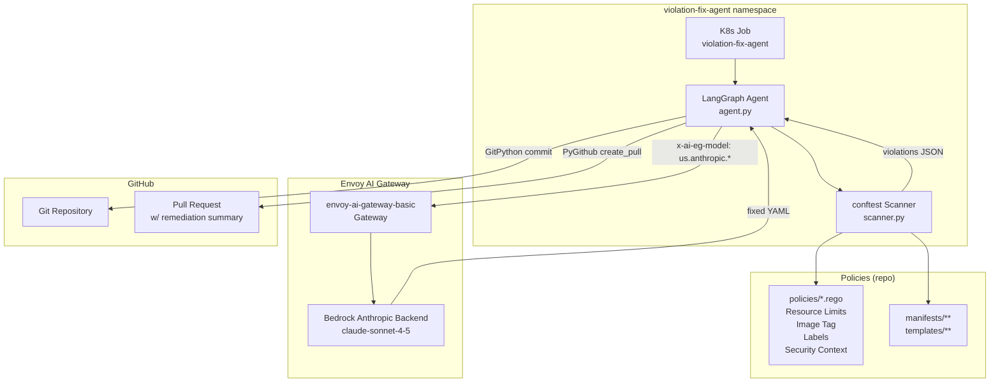
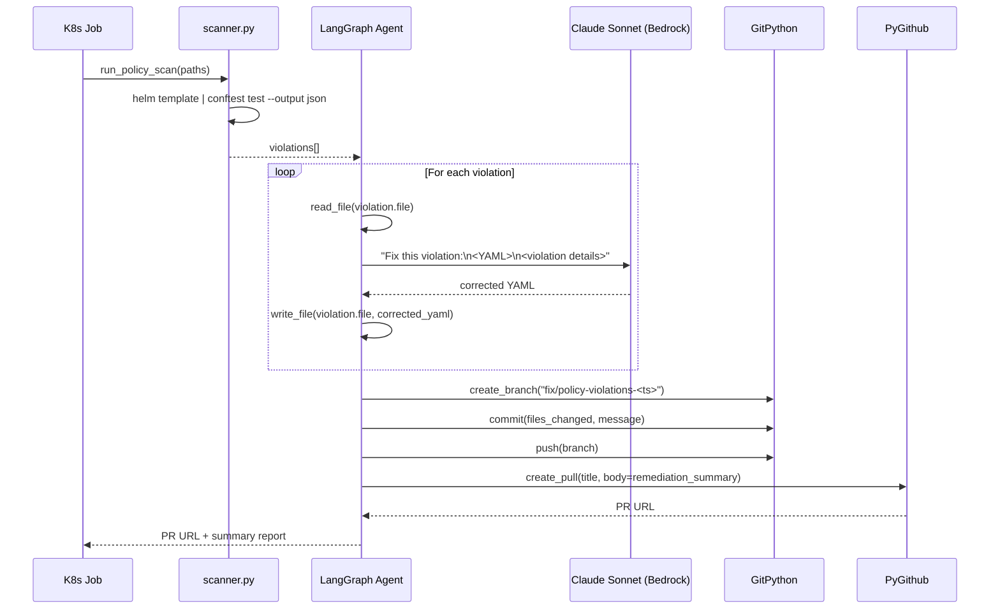

# OPA Policy Violation Fix Agent

## Overview

This spec covers a two-phase system: (1) static OPA policy enforcement that scans Kubernetes manifests and Helm chart templates using `conftest` and Rego policies without requiring a live cluster, and (2) a LangGraph ReAct agent that consumes the violation report, edits the offending YAML files, and raises a pull request with a detailed remediation summary. The goal is to enforce Kubernetes best practices (resource limits, security context, image tag pinning, required labels) as a pre-deployment quality gate and to automate the remediation loop.

## Requirement Description

**Problem:** The repository contains Kubernetes manifests and Helm values files that may violate operational policies (missing resource limits, running as root, using `latest` image tags, missing namespace labels). These violations are currently caught only at runtime or via manual review, which is costly and slow.

**What this builds:**
- A set of Rego policies (mirroring common Gatekeeper ConstraintTemplates) that can be applied statically using `conftest`
- A LangGraph agent that runs the scan, plans fixes for each violation using Claude Sonnet (via the existing Envoy AI Gateway), edits the YAML, commits, and opens a GitHub PR

**Scope:**
- Scans all files under `manifests/` and `templates/`
- Renders Helm charts via `helm template` before scanning Helm values-only directories
- Policies enforced: required resource limits/requests, disallow `latest` image tag, required `app` and `env` labels on Pods/Jobs, non-root user enforcement
- Runs as a Kubernetes Job in the cluster (follows project pattern) or locally

**Non-goals:**
- Does not enforce network policies or RBAC rules
- Does not create production Gatekeeper `ConstraintTemplate` CRDs in the cluster
- Does not run as a continuous admission controller

## Introduction

The project already has four LangGraph agents (first, fallback, istio, guardrails) deployed as Kubernetes Jobs, all routed through the Envoy AI Gateway. The guardrails sidecar demonstrates that the project can intercept and act on policy violations at the proxy layer. This new agent adds a development-time policy gate: violations are caught before manifests ever reach the cluster.

`conftest` is chosen over `gator` because it requires only plain Rego files (no full Gatekeeper `ConstraintTemplate` CRD authoring), works offline, and supports piping `helm template` output directly. The static scan produces a structured JSON violation report that the LangGraph agent uses as its initial state.

## Solution

### Architecture

The system has three runtime phases that run sequentially:

1. **Scan phase** — `conftest` renders and validates all manifests against Rego policies, emitting a JSON violation report.
2. **Fix phase** — The LangGraph ReAct agent iterates over violations, reads the offending files, produces corrected YAML using Claude Sonnet, and writes the fixes back.
3. **PR phase** — GitPython creates a branch and commit; PyGithub opens a pull request with a structured remediation summary.

The agent runs inside the Kind cluster as a Kubernetes Job (namespace `violation-fix-agent`). It reaches the Envoy AI Gateway at the in-cluster service hostname for LLM calls, and reaches GitHub via the public internet using a mounted `GITHUB_TOKEN` secret.

#### Architecture Diagram



#### Data Flow Diagram



### Design Decisions

**`conftest` over `gator`**: Gator requires full Gatekeeper `ConstraintTemplate` CRDs (verbose authoring, versioned schema) and has edge-case bugs with piped Helm output (null-handling in YAML mode). Conftest accepts plain Rego files and JSON output is stable. The Rego policies are written to mirror common Gatekeeper constraints so they can be ported to production Gatekeeper if needed.

**Claude Sonnet via existing Envoy AI Gateway**: The project already has the `us.anthropic.claude-sonnet-4-5-20250929-v1:0` route configured in the `envoy-ai-gateway-basic` gateway. Using it keeps credential management centralised in `BackendSecurityPolicy` and avoids adding a new secret for a direct Anthropic API key.

**LangGraph ReAct with per-violation tool calls**: Rather than sending all violations in one prompt, the agent loops over each violation individually (`read_file` → LLM fix → `write_file`). This keeps context windows small, avoids multi-file confusion, and makes the agent's reasoning auditable per violation.

**GitPython + PyGithub**: GitPython handles local git operations (branch creation, staging, commit, push). PyGithub handles the GitHub API call to open the PR with a templated body. This split avoids subprocess shell injection and keeps each concern in a typed Python SDK.

**K8s Job deployment**: Matches the pattern used by all four existing agents. The job mounts a `GITHUB_TOKEN` Secret and a `REPO_URL` env var. The agent clones the repo at startup (or uses the mounted working directory if running locally).

## Limitations

1. **YAML round-tripping loses comments**: `ruamel.yaml` (preferred) or `pyyaml` will drop or reformat inline comments when writing fixed manifests. The LLM must preserve comments explicitly in its output prompt.
2. **Complex multi-document Helm charts not fully rendered**: Charts with `lookup` or cluster-state-dependent conditionals will render differently offline than in-cluster. `helm template --validate=false` is used to work around schema validation, but logic-dependent rendering failures produce incomplete violation sets.
3. **LLM hallucination in YAML edits**: Claude Sonnet may produce syntactically valid but semantically wrong YAML (e.g., correct `resources.limits` structure but wrong CPU unit format). The scanner re-runs after each fix to detect this, adding latency.
4. **GitHub rate limits**: PyGithub uses the REST API; a large number of file commits in rapid succession (for repos with many violations) can hit secondary rate limits. The agent adds a 1-second delay between commits.
5. **No idempotency guard**: If the agent Job is re-run before a previous PR is merged, it will open a second PR. The agent checks for open PRs with the same branch prefix before creating a new one but does not handle merge-conflict resolution.
6. **Helm-values-only directories**: `templates/mcp-server/` contains only `helm-values.yaml` with no chart source. The agent must fetch the upstream chart to render it, which requires internet access from inside the Kind cluster.

## Deployment Steps

### Prerequisites

```bash
# Install conftest locally (for testing the scanner outside the cluster)
brew install conftest  # macOS
# or
winget install Open-Policy-Agent.conftest  # Windows
```

### Step 1: Add OPA Rego policies

Create `policies/` at repo root with the following files:
- `required-labels.rego` — `app` and `env` labels required on Pod and Job specs
- `resource-limits.rego` — `resources.limits.cpu` and `resources.limits.memory` required on every container
- `image-tag.rego` — disallow image tags `:latest` or missing tags
- `security-context.rego` — require `runAsNonRoot: true` and `allowPrivilegeEscalation: false`

```bash
# Test policies against manifests locally
helm template mcp-server kubernetes-mcp-server/kubernetes-mcp-server \
  -f templates/mcp-server/helm-values.yaml | \
  conftest test -p policies/ --output json -

conftest test -p policies/ manifests/ templates/ --output json
```

### Step 2: Build and push the agent image

```bash
# From repo root
docker build -t localhost:5001/violation-fix-agent:latest agents/violation-fix-agent/
docker push localhost:5001/violation-fix-agent:latest
```

### Step 3: Create the GitHub token Secret

```bash
kubectl create namespace violation-fix-agent
kubectl create secret generic github-token \
  -n violation-fix-agent \
  --from-literal=token=<your-github-pat>
```

The PAT requires scopes: `repo` (full repository access).

### Step 4: Apply the Kubernetes Job manifest

```bash
kubectl apply -f manifests/violation-fix-agent/job.yaml
```

### Step 5: Monitor and retrieve results

```bash
kubectl logs -n violation-fix-agent \
  -l app=violation-fix-agent --follow

# PR URL is printed at the end of the logs
```

## POC Plan

### POC Scope

Demonstrate the end-to-end flow on the existing `manifests/first-agent/job.yaml` only:
1. Introduce a deliberate violation (remove `resources.limits` from the Job container spec)
2. Run the scanner locally with `conftest test -p policies/ manifests/first-agent/ --output json`
3. Feed the output to a simplified (non-K8s) version of the agent running locally with `python agents/violation-fix-agent/agent.py --local`
4. Verify the agent edits `job.yaml` to add correct resource limits
5. Verify the agent opens a GitHub PR with a populated description

The POC does not need to run inside the cluster, handle Helm rendering, or fix multiple violations in one run.

### POC Timeline

| Phase | Task | Estimate |
|---|---|---|
| 1 | Write 2 Rego policies (resource-limits, image-tag) and verify with conftest | 2h |
| 2 | Write `scanner.py` conftest wrapper with JSON output parsing | 1h |
| 3 | Write LangGraph agent with `read_file`, `write_file`, `run_scan` tools (no git) | 3h |
| 4 | Add GitPython + PyGithub PR creation tools | 2h |
| 5 | Wire local `--local` mode, test end-to-end on single manifest | 2h |
| 6 | Write Dockerfile and K8s Job manifest | 1h |
| **Total** | | **11h** |

## Manual Steps

- **Generate GitHub PAT**: Create a fine-grained PAT at GitHub → Settings → Developer Settings → Personal Access Tokens. Scope: `Contents: Read and Write`, `Pull Requests: Read and Write` on the target repository.
- **Kubernetes Secret**: The `github-token` Secret must be created manually (`kubectl create secret`) — it is not checked in.
- **AWS Credentials**: The Bedrock Anthropic backend already has credentials via the existing `BackendSecurityPolicy` (`envoy-ai-gateway-basic-aws-credentials`). No new credentials needed for the LLM call.
- **conftest binary in Docker image**: The `Dockerfile` must install `conftest` from the upstream release binary (not via pip), and Helm CLI for chart rendering. These are large binaries (~50 MB each); verify the final image size.
- **Helm chart cache**: If the agent needs to render upstream Helm charts (e.g., kubernetes-mcp-server), it must `helm repo add` and `helm pull` at startup, which requires outbound internet access from the Kind cluster node.

## Automation & Coding Tasks

### `policies/` — Rego policy files

Write four `.rego` files. Each must export `violation[msg]` (conftest convention). Example structure:

```rego
# policies/resource-limits.rego
package kubernetes.policies.resource_limits

violation[msg] {
  input.kind == "Job"
  container := input.spec.template.spec.containers[_]
  not container.resources.limits.cpu
  msg := sprintf("container '%s' missing resources.limits.cpu", [container.name])
}
```

Policies: `required-labels.rego`, `resource-limits.rego`, `image-tag.rego`, `security-context.rego`.

### `agents/violation-fix-agent/scanner.py`

- `scan(paths: list[str]) -> list[Violation]`
- For each path: if it's a Helm values file, first run `helm template` and pipe to conftest; otherwise run conftest directly
- Parse `--output json` into `Violation(file, policy, message, resource)` dataclass
- Returns deduplicated list sorted by file path

### `agents/violation-fix-agent/agent.py`

LangGraph ReAct agent with the following tools:

| Tool | Description |
|---|---|
| `run_policy_scan(paths)` | Calls scanner.py; returns violation list |
| `read_file(path)` | Reads YAML file content |
| `write_file(path, content)` | Writes corrected YAML back to disk |
| `list_manifests()` | Lists all `.yaml` files under `manifests/` and `templates/` |
| `git_create_branch(name)` | Creates and checks out a new git branch |
| `git_commit_push(files, message)` | Stages named files, commits, pushes to remote |
| `create_pull_request(branch, title, body)` | Creates PR via PyGithub |

Agent system prompt instructs it to:
1. Run `run_policy_scan` first to enumerate violations
2. For each violation: `read_file` → call LLM with the YAML + violation message → `write_file`
3. Re-run `run_policy_scan` on modified files to confirm fix worked
4. Commit all changed files in one commit
5. Create PR with structured body (see PR template below)

**PR body template** (generated by the agent):
```markdown
## Policy Violation Remediation

This PR was automatically generated by the OPA Violation Fix Agent.

### Violations Found

| File | Policy | Resource | Message |
|------|--------|----------|---------|
| manifests/first-agent/job.yaml | resource-limits | first-agent | container 'first-agent' missing resources.limits.cpu |

### Changes Made

- `manifests/first-agent/job.yaml`: Added `resources.limits.cpu: 500m` and `resources.limits.memory: 256Mi` to container spec

### Policies Applied

- **resource-limits**: All containers must declare `resources.limits.cpu` and `resources.limits.memory`
- **image-tag**: Image tags must be pinned (no `:latest`)

### Scan Results After Fix

All N violations resolved. Conftest exits 0.
```

### `agents/violation-fix-agent/requirements.txt`

```
langgraph>=0.2.0
langchain-openai>=0.2.0
langchain-core>=0.3.0
openai>=1.0.0
PyGithub>=2.1.1
GitPython>=3.1.40
ruamel.yaml>=0.18.0
```

### `agents/violation-fix-agent/Dockerfile`

Base image: `python:3.12-slim`. Additional steps:
- Install `conftest` binary from GitHub releases (amd64 Linux)
- Install `helm` binary
- Install Python dependencies

### `manifests/violation-fix-agent/job.yaml`

Follows existing Job pattern:
- Namespace: `violation-fix-agent`
- `backoffLimit: 0`
- Env vars: `GATEWAY_URL`, `GITHUB_TOKEN` (from Secret), `REPO_URL`, `REPO_BRANCH` (default: `master`), `MODEL_ID`
- `imagePullPolicy: Always`
- Image: `localhost:5001/violation-fix-agent:latest`

## Test Plan

### Unit tests

- `test_scanner.py`: mock `subprocess.run` output for `conftest`; verify `Violation` dataclass parsing for single-violation and multi-violation JSON, empty output, and conftest exit-code 0 with warnings
- `test_policies.py`: for each `.rego` file, use the `conftest` Python SDK or subprocess to test a compliant manifest (expects 0 violations) and a non-compliant manifest (expects ≥ 1 violation)

### Integration tests

- Run scanner against `manifests/first-agent/job.yaml` with `resource-limits` policy after removing `resources.limits` — verify 2 violations (CPU + memory) are returned
- Run scanner against all manifests, assert it completes in < 30 seconds

### End-to-end tests

1. Introduce deliberate violations in a test branch
2. Run the agent locally (`python agent.py --local --dry-run`) — verify it produces a corrected YAML and prints the PR body without actually creating a PR
3. Run the agent with `--dry-run=false` against a test fork — verify a real PR is created with the correct body
4. Re-run the scanner against the PR branch — verify conftest exits 0

### Rollback test

- Delete the Job: `kubectl delete job violation-fix-agent -n violation-fix-agent`
- Close the PR on GitHub manually
- Reset the test branch: `git push origin --delete fix/policy-violations-<ts>`

## Acceptance Criteria

1. Running `conftest test -p policies/ manifests/ templates/ --output json` produces structured JSON with at least one violation against the current repo state.
2. All four Rego policies (resource-limits, image-tag, required-labels, security-context) produce at least one violation against an unmodified manifest and zero violations against a manifest that satisfies the policy.
3. The agent, when run with `--dry-run`, prints a PR body that includes a Markdown table listing every violation found, with columns: File, Policy, Resource, Message.
4. The agent, when run end-to-end, creates a GitHub PR whose branch contains only the modified manifest files (no unrelated files staged).
5. After the PR branch is checked out locally, `conftest test -p policies/ manifests/ templates/` exits with code 0 (no violations).
6. The K8s Job in the `violation-fix-agent` namespace completes with `Completed` status (not `Failed`) when run against the repo.
7. The agent completes within 10 minutes for a repo with ≤ 50 manifest files.
8. If a violation cannot be fixed (LLM produces invalid YAML after 3 retries), the agent skips that file, logs a warning, and continues with remaining violations — it does not abort entirely.
