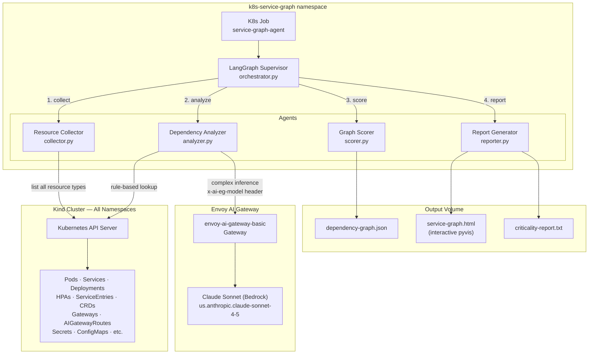
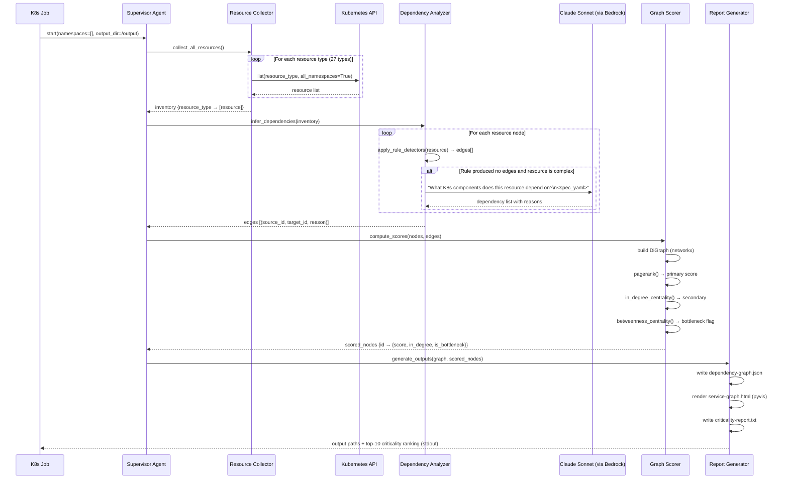
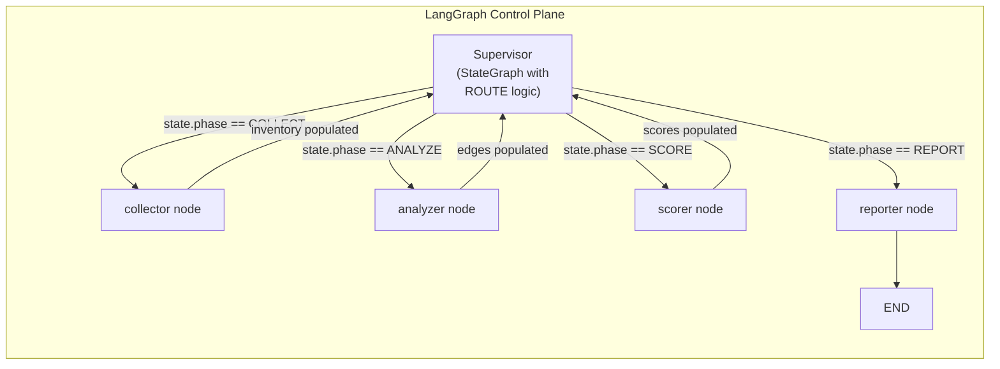

# Kubernetes Service Dependency Graph Agent

## Overview

This spec covers a multi-agent system that discovers all components and applications deployed in a Kubernetes cluster, infers their dependencies through rule-based detection and LLM-assisted analysis, builds a directed dependency graph, and assigns a criticality score to each component. The output helps engineers understand blast radius before deploying changes and aids in debugging by surfacing which upstream components to verify when a service misbehaves.

## Requirement Description

**Problem:** In a complex Kubernetes cluster — like this platform with Envoy Gateway, Envoy AI Gateway, Istio, Redis, MCP server, and multiple LangGraph agents — it is difficult to know what a given component depends on or what depends on it. Upgrading or modifying a component without this knowledge risks cascading failures that are hard to anticipate and debug.

**What this builds:**
- A multi-agent LangGraph system that enumerates every Kubernetes resource across all namespaces, infers dependency edges between them, builds a directed graph, and scores each node by criticality.
- AWS service dependency detection via Istio `ServiceEntry` resources (maps FQDN patterns to named AWS services).
- An interactive HTML visualization and structured JSON export of the graph.
- A criticality ranking report identifying the highest-risk components to change.

**Scope:**
- Runs against the Kind cluster in-cluster as a Kubernetes Job.
- Detects dependencies at the manifest level — no runtime traffic analysis.
- Scores using PageRank (captures transitive criticality) and in-degree (direct dependency count).
- Covers all namespaces unless filtered by flag.

**Non-goals:**
- Real-time or streaming dependency tracking.
- Code-level dependency analysis (e.g., HTTP calls inside application source).
- Cross-cluster or multi-region topology.
- Automatic remediation of dependency risks.

## Introduction

The platform currently hosts: Envoy Gateway (v1.8.0), Envoy AI Gateway (v0.6.0), Istio (v1.24.6), Redis (rate-limit state), the kubernetes-mcp-server, and several LangGraph agent Jobs. Each component has implicit relationships — the agent Jobs depend on the AI Gateway, the AI Gateway depends on `BackendSecurityPolicy` Secrets, Istio sidecars depend on `istiod`, HPAs depend on metrics-server — but this topology is documented only in prose. As the platform grows, understanding the blast radius of a change to any single component requires manually tracing YAML references across dozens of files and namespaces.

The kubernetes-mcp-server (already deployed, `kubernetes-mcp-server` namespace, cluster-wide `edit` RBAC) provides a ready-made cluster query interface. However, for programmatic graph construction, the Python `kubernetes` client is more suitable than JSON-RPC over MCP. The LLM (Claude Sonnet via the existing Envoy AI Gateway) is used only for complex, non-obvious relationship inference that cannot be expressed as a deterministic rule.

## Solution

### Architecture

The system is a LangGraph multi-agent pipeline deployed as a single Kubernetes Job. A **Supervisor agent** coordinates four specialist agents in sequence: **Resource Collector** (enumerates all K8s resources via the API), **Dependency Analyzer** (applies rule-based detectors and calls the LLM for ambiguous relationships), **Graph Scorer** (builds the NetworkX digraph and computes centrality scores), and **Report Generator** (produces JSON, interactive HTML, and a text ranking).

The job writes outputs to an `emptyDir` volume and optionally to a PersistentVolumeClaim or uploads them to S3. For the POC, outputs are printed to stdout in JSON and the HTML is written to `/output/`.

#### Architecture Diagram



#### Data Flow Diagram



#### Control Plane Diagram



### Dependency Detection Rules

The Dependency Analyzer applies the following rule categories in order. Each rule emits zero or more directed edges `(dependent → dependency, reason)`.

**Namespace-level rules**

| Rule | Trigger | Edge added |
|---|---|---|
| NS-01 | Namespace has label `istio-injection=enabled` | Every pod in that namespace → `istio-system/istiod` |
| NS-02 | Namespace has label `argocd.argoproj.io/managed-by` | Namespace → ArgoCD application controller |

**Workload-level rules**

| Rule | Trigger | Edge added |
|---|---|---|
| WL-01 | Pod `spec.serviceAccountName` set | Pod → ServiceAccount (same ns) |
| WL-02 | Pod env `valueFrom.configMapKeyRef` or volume `configMap` | Pod → ConfigMap |
| WL-03 | Pod env `valueFrom.secretKeyRef` or volume `secret` | Pod → Secret |
| WL-04 | Pod volume `persistentVolumeClaim` | Pod → PVC → StorageClass |
| WL-05 | Pod annotation `sidecar.istio.io/inject: "true"` | Pod → `istio-system/istiod` |
| WL-06 | Pod `imagePullSecrets` | Pod → referenced Secret |
| WL-07 | Init container present | Pod → service resolved by init container (LLM infers) |

**Autoscaling rules**

| Rule | Trigger | Edge added |
|---|---|---|
| AS-01 | HPA `scaleTargetRef` | HPA → target Deployment/StatefulSet |
| AS-02 | HPA present in namespace | HPA + target → `kube-system/metrics-server` |
| AS-03 | VPA `targetRef` | VPA → target + `kube-system/vpa-admission-controller` |

**Istio mesh rules**

| Rule | Trigger | Edge added |
|---|---|---|
| IS-01 | `VirtualService` `spec.gateways` | VirtualService → Istio Gateway |
| IS-02 | `VirtualService` `spec.http[].route[].destination.host` | VirtualService → target Service |
| IS-03 | `DestinationRule` `spec.host` | DestinationRule → target Service |
| IS-04 | `Gateway` of class `istio` | Gateway → `istio-system/istio-ingressgateway` |
| IS-05 | `PeerAuthentication` mode `STRICT` in a namespace | All pods in namespace → `istio-system/istiod` |
| IS-06 | `AuthorizationPolicy` | AuthorizationPolicy → `istio-system/istiod` |

**Istio ServiceEntry → AWS service mapping**

| FQDN pattern | AWS Service | Edge added |
|---|---|---|
| `bedrock-runtime.*.amazonaws.com` | AWS Bedrock Runtime | ServiceEntry → `aws/bedrock-runtime` |
| `s3.*.amazonaws.com` or `*.s3.amazonaws.com` | AWS S3 | ServiceEntry → `aws/s3` |
| `secretsmanager.*.amazonaws.com` | AWS Secrets Manager | ServiceEntry → `aws/secrets-manager` |
| `kms.*.amazonaws.com` | AWS KMS | ServiceEntry → `aws/kms` |
| `sqs.*.amazonaws.com` | AWS SQS | ServiceEntry → `aws/sqs` |
| `dynamodb.*.amazonaws.com` | AWS DynamoDB | ServiceEntry → `aws/dynamodb` |
| `logs.*.amazonaws.com` or `monitoring.*.amazonaws.com` | AWS CloudWatch | ServiceEntry → `aws/cloudwatch` |
| `eks.*.amazonaws.com` | AWS EKS API | ServiceEntry → `aws/eks` |

The pods and workloads in the same namespace as the `ServiceEntry` are linked: Pod → ServiceEntry → AWS service virtual node.

**Envoy / Gateway API rules**

| Rule | Trigger | Edge added |
|---|---|---|
| EG-01 | `HTTPRoute`/`AIGatewayRoute` `parentRefs` | Route → Gateway |
| EG-02 | `AIGatewayRoute` backend name | Route → `AIServiceBackend` |
| EG-03 | `AIServiceBackend` `backendRef` | AIServiceBackend → `Backend` (gateway.envoyproxy.io) |
| EG-04 | `BackendSecurityPolicy` `targetRefs` | BackendSecurityPolicy → AIServiceBackend |
| EG-05 | `BackendSecurityPolicy` `aws.credentials.secretRef` | BackendSecurityPolicy → Secret |
| EG-06 | `BackendTLSPolicy` `targetRefs` | BackendTLSPolicy → Backend |
| EG-07 | `EnvoyExtensionPolicy` `extProc[].backendRefs` | Policy → ext_proc Service (e.g., guardrail sidecar) |
| EG-08 | `EnvoyProxy` present in namespace | Envoy Proxy config → Envoy Gateway controller |

**ArgoCD rules**

| Rule | Trigger | Edge added |
|---|---|---|
| AR-01 | `Application` CRD exists | Application → ArgoCD application controller |
| AR-02 | `Application` `spec.project` | Application → `AppProject` |
| AR-03 | `Application` `spec.source.repoURL` | Application → Git repository (virtual node) |
| AR-04 | `Application` `spec.destination.namespace` | Application → target namespace resources |

**Storage / certificate rules**

| Rule | Trigger | Edge added |
|---|---|---|
| ST-01 | PVC `spec.storageClassName` | PVC → StorageClass |
| ST-02 | `Certificate` (cert-manager) | Certificate → `Issuer`/`ClusterIssuer` |
| ST-03 | Pod annotation `cert-manager.io/inject-ca-from` | Pod → cert-manager controller |

**Rate-limiting / Redis rule**

| Rule | Trigger | Edge added |
|---|---|---|
| RL-01 | `BackendTrafficPolicy` with `rateLimit` set | Policy + target → Redis Service (`redis-system/redis`) |
| RL-02 | Redis Service present | Redis → `redis-system` namespace |

**RBAC rules**

| Rule | Trigger | Edge added |
|---|---|---|
| RB-01 | `RoleBinding`/`ClusterRoleBinding` `subjects` | ServiceAccount → `Role`/`ClusterRole` |
| RB-02 | ServiceAccount with mounted token | Pod → Kubernetes API Server (virtual node) |

**LLM-assisted inference**

For any resource whose spec is complex or non-standard (unknown CRDs, multi-field cross-references), the analyzer submits a structured prompt to Claude Sonnet via the Envoy AI Gateway. The prompt includes the full resource YAML and asks the model to list, in JSON, what Kubernetes components the resource depends on and why. Results are merged with rule-based edges; duplicates are deduplicated.

### Criticality Scoring

Each node receives three scores computed by NetworkX on the reversed graph (edges point FROM dependency TO dependent, so in-degree = "how many things depend on me"):

| Score | Algorithm | Meaning |
|---|---|---|
| `pagerank_score` | PageRank (α=0.85) on reversed graph | Transitive criticality — a node is critical if critical things depend on it |
| `in_degree_score` | In-degree centrality (normalized 0–1) | Direct dependency count |
| `betweenness_score` | Betweenness centrality | Bottleneck — removing this node disconnects many paths |

**Final criticality score** (0–100):

```
criticality = round(
    (0.5 * pagerank_score_normalized +
     0.3 * in_degree_score +
     0.2 * betweenness_score) * 100, 2
)
```

Nodes with zero dependents score 0. AWS virtual nodes (e.g., `aws/bedrock-runtime`) can receive high scores if many workloads depend on them via ServiceEntry.

### Design Decisions

**Python kubernetes client over MCP**: The kubernetes-mcp-server is already deployed with cluster-wide edit RBAC but its JSON-RPC interface adds latency and requires wrapping each resource type separately. The Python `kubernetes` client's `list_cluster_custom_object` and `list_namespaced_*` APIs return typed objects that map directly to the graph builder. For the agent Job, a ServiceAccount with `ClusterRole=view` is sufficient (read-only).

**NetworkX PageRank for scoring**: PageRank on the reversed dependency graph naturally captures transitive criticality — a component that only a few things depend on directly but those few things are themselves widely depended on still ranks highly. In-degree alone misses this. Betweenness identifies architectural chokepoints even when their direct in-degree is moderate.

**LLM only for ambiguous cases**: Running every resource through the LLM would be expensive and slow. Rule-based detectors cover the vast majority of patterns in a standard cluster. The LLM is invoked only when: (a) the resource uses a CRD the rules do not recognise, (b) the resource has cross-namespace references that cannot be statically resolved, or (c) init container commands imply network dependencies.

**pyvis for HTML visualization**: pyvis wraps vis.js and produces a self-contained interactive HTML file with no external runtime dependencies. Nodes are colored by criticality score (green → yellow → red), and clicking a node shows its dependency edges and score. This requires no dashboard server inside the cluster.

**Single Job over a long-running controller**: The dependency graph is a point-in-time snapshot; continuous reconciliation is out of scope. The Job pattern matches the existing agents in this repository. The Job can be triggered via a CronJob for periodic snapshots.

## Limitations

1. **Manifest-level only — no runtime traffic capture**: Dependencies expressed purely in code (an app calling another app's Service by DNS without any K8s manifest relationship) are invisible. The graph shows declared relationships, not actual traffic paths.
2. **Deleted or pending resources**: Resources that existed before the Job runs but were deleted during collection produce dangling edges. The scorer ignores nodes with no matching resource (treats them as virtual/external).
3. **LLM inference accuracy**: Claude Sonnet may hallucinate dependencies for unfamiliar CRDs. Each LLM-inferred edge is tagged `source=llm` in the JSON output so engineers can review them separately.
4. **Large clusters**: Clusters with >5,000 resources may require 10–20 minutes for analysis. The LLM call rate is limited by the AI Gateway's token budget (rate-limiting BackendTrafficPolicy). At default settings, LLM inference is throttled per the configured token bucket.
5. **AWS service nodes are virtual**: AWS services (`aws/bedrock-runtime` etc.) are synthetic nodes constructed from ServiceEntry FQDNs. They have no Kubernetes resource backing, so their attributes (replicas, namespace, owner) are null.
6. **Dynamic ServiceEntry hosts**: ServiceEntries using wildcard hosts (`*.amazonaws.com`) may undercount or overcount the AWS services actually called. The analyzer maps only the FQDN patterns listed in the detection rules table.
7. **CRD controller inference**: For unknown CRDs, the analyzer assumes the controller lives in the same namespace as the CRD installation. This is often correct but not guaranteed for cluster-scoped controllers in non-standard namespaces.

## Deployment Steps

### Prerequisites

```bash
# Verify the Kind cluster is running and existing components are healthy
kubectl get nodes
kubectl get pods -A | grep -E "(envoy|istio|redis|mcp)"
```

### Step 1: Build the agent image

```bash
docker build -t localhost:5001/service-graph-agent:latest agents/service-graph-agent/
docker push localhost:5001/service-graph-agent:latest
```

### Step 2: Create the namespace and RBAC

```bash
kubectl create namespace k8s-service-graph

# ClusterRole: read all resources (including CRDs)
kubectl apply -f manifests/service-graph-agent/rbac.yaml
```

`rbac.yaml` creates a `ClusterRole` with `get`, `list`, `watch` on `*` resources and binds it to the `service-graph-agent` ServiceAccount in the `k8s-service-graph` namespace.

### Step 3: Create the output PVC (optional, for persistent output)

```bash
kubectl apply -f manifests/service-graph-agent/pvc.yaml
```

For the POC, skip this step — outputs are printed to stdout and the HTML is saved to an `emptyDir`. Retrieve the HTML with `kubectl cp`.

### Step 4: Apply and run the Job

```bash
kubectl apply -f manifests/service-graph-agent/job.yaml

# Watch progress
kubectl logs -n k8s-service-graph -l app=service-graph-agent --follow
```

### Step 5: Retrieve outputs

```bash
POD=$(kubectl get pod -n k8s-service-graph -l app=service-graph-agent -o jsonpath='{.items[0].metadata.name}')

kubectl cp k8s-service-graph/${POD}:/output/dependency-graph.json ./dependency-graph.json
kubectl cp k8s-service-graph/${POD}:/output/service-graph.html ./service-graph.html
kubectl cp k8s-service-graph/${POD}:/output/criticality-report.txt ./criticality-report.txt

# Open visualization in browser
start service-graph.html   # Windows
open service-graph.html    # macOS
```

### Step 6: Schedule periodic runs (optional)

```bash
kubectl apply -f manifests/service-graph-agent/cronjob.yaml
# CronJob runs daily at 02:00 UTC, keeps last 3 Job records
```

## POC Plan

### POC Scope

Demonstrate the end-to-end pipeline on the existing Kind cluster without LLM-assisted inference (rule-based only) and with a simplified HTML output:

1. The collector enumerates Pods, Services, Deployments, HPAs, Gateways, AIGatewayRoutes, AIServiceBackends, ServiceEntries, and Secrets across all namespaces.
2. The analyzer applies the NS-01 (Istio injection), AS-01/AS-02 (HPA → metrics-server), EG-01 to EG-05 (Envoy Gateway chain), IS-06 (ServiceEntry → AWS), and RL-01/RL-02 (Redis rate-limit) rules.
3. The scorer computes in-degree and PageRank and prints the top-10 critical components to stdout.
4. A JSON file is written and a basic pyvis HTML is generated showing the graph.

The POC does not implement LLM inference, ArgoCD rules, cert-manager rules, or VPA rules. It does not run as a Kubernetes Job — it runs locally via `python agent.py --local --kubeconfig ~/.kube/config`.

### POC Timeline

| Phase | Task | Estimate |
|---|---|---|
| 1 | `collector.py`: list resources via Python k8s client (10 resource types) | 3h |
| 2 | `analyzer.py`: implement NS-01, AS-01/02, EG-01–05, IS-06, RL-01/02 rules | 4h |
| 3 | `scorer.py`: NetworkX digraph, PageRank, in-degree, JSON export | 2h |
| 4 | `reporter.py`: pyvis HTML generation, criticality-report.txt | 2h |
| 5 | `orchestrator.py`: LangGraph StateGraph wiring all four nodes | 2h |
| 6 | Local `--local` mode, test against live Kind cluster | 2h |
| 7 | Dockerfile + K8s Job manifest + RBAC | 2h |
| **Total** | | **17h** |

## Manual Steps

- **ClusterRole approval**: The `ClusterRole` grants `get`/`list`/`watch` on all resources (`*` in `apiGroups`). In production clusters with RBAC auditing, this may require explicit sign-off from a cluster admin.
- **PVC provisioner**: The Kind cluster uses the `standard` StorageClass (local-path). If a persistent output PVC is desired, verify `kubectl get storageclass` lists `standard` as the default provisioner before applying `pvc.yaml`.
- **ServiceEntry FQDN list maintenance**: As the platform adds new AWS integrations, the FQDN-to-service mapping table in `analyzer.py` must be updated manually. There is no auto-discovery of new patterns.
- **AWS virtual node naming**: The virtual nodes (`aws/bedrock-runtime`, `aws/s3`, etc.) are synthetic and do not correspond to real Kubernetes objects. Engineers must understand this distinction when reading the graph.
- **Kubeconfig for local runs**: Running the POC locally requires a valid `~/.kube/config` pointing at the Kind cluster. Ensure `kubectl get nodes` works before running `python agent.py --local`.

## Automation & Coding Tasks

### `agents/service-graph-agent/collector.py`

Implements `collect_all_resources(namespaces: list[str] | None) -> ResourceInventory`.

Resource types to enumerate (using `kubernetes` Python client):

```python
RESOURCE_TYPES = [
    ("v1", "pods"), ("v1", "services"), ("v1", "configmaps"),
    ("v1", "secrets"), ("v1", "namespaces"), ("v1", "serviceaccounts"),
    ("v1", "persistentvolumeclaims"), ("v1", "persistentvolumes"),
    ("apps/v1", "deployments"), ("apps/v1", "statefulsets"), ("apps/v1", "daemonsets"),
    ("autoscaling/v2", "horizontalpodautoscalers"),
    ("batch/v1", "jobs"), ("batch/v1", "cronjobs"),
    ("networking.k8s.io/v1", "networkpolicies"),
    ("gateway.networking.k8s.io/v1", "gateways"),
    ("gateway.networking.k8s.io/v1", "httproutes"),
    ("gateway.envoyproxy.io/v1alpha1", "backends"),
    ("aigateway.envoyproxy.io/v1beta1", "aigatewayroutes"),
    ("aigateway.envoyproxy.io/v1beta1", "aiservicebackends"),
    ("aigateway.envoyproxy.io/v1beta1", "backendsecuritypolicies"),
    ("aigateway.envoyproxy.io/v1beta1", "backendtrafficpolicies"),
    ("networking.istio.io/v1beta1", "virtualservices"),
    ("networking.istio.io/v1beta1", "destinationrules"),
    ("networking.istio.io/v1beta1", "serviceentries"),
    ("networking.istio.io/v1beta1", "gateways"),
    ("security.istio.io/v1beta1", "peerauthentications"),
    ("security.istio.io/v1beta1", "authorizationpolicies"),
    ("rbac.authorization.k8s.io/v1", "clusterrolebindings"),
    ("rbac.authorization.k8s.io/v1", "rolebindings"),
    ("storage.k8s.io/v1", "storageclasses"),
    ("argoproj.io/v1alpha1", "applications"),
    ("argoproj.io/v1alpha1", "appprojects"),
]
```

Unknown CRDs are discovered via `kubectl get crds` and enumerated via `list_cluster_custom_object`. Each resource is stored as a `K8sResource(id, kind, name, namespace, labels, annotations, spec_yaml)` dataclass.

### `agents/service-graph-agent/analyzer.py`

Implements `infer_dependencies(inventory: ResourceInventory) -> list[Edge]`.

- Each rule is a function `rule_name(resource, inventory) -> list[Edge]`.
- Rules are registered in a list; the analyzer iterates resources and applies all matching rules.
- LLM inference: resources with unknown CRD kinds and no rule matches are sent to Claude Sonnet via `openai.OpenAI(base_url=GATEWAY_URL)` using the `x-ai-eg-model` header set to `us.anthropic.claude-sonnet-4-5-20250929-v1:0`. The system prompt instructs the model to return a JSON list of `{"depends_on": "<kind>/<namespace>/<name>", "reason": "<string>"}`.
- All edges are `Edge(source_id, target_id, reason, source="rule"|"llm")`.

### `agents/service-graph-agent/scorer.py`

Implements `compute_scores(nodes: list[K8sResource], edges: list[Edge]) -> dict[str, NodeScore]`.

```python
import networkx as nx

def compute_scores(nodes, edges):
    G = nx.DiGraph()
    for n in nodes:
        G.add_node(n.id, **n.attrs)
    for e in edges:
        G.add_edge(e.source_id, e.target_id, reason=e.reason)

    # Reverse: edges point from dependency TO dependent
    R = G.reverse()
    pr = nx.pagerank(R, alpha=0.85)
    idc = nx.in_degree_centrality(R)
    bc = nx.betweenness_centrality(R, normalized=True)

    # Normalize PR to 0-1
    max_pr = max(pr.values()) or 1
    scores = {}
    for node_id in G.nodes:
        pagerank_n = pr.get(node_id, 0) / max_pr
        score = round(
            (0.5 * pagerank_n + 0.3 * idc.get(node_id, 0) + 0.2 * bc.get(node_id, 0)) * 100, 2
        )
        scores[node_id] = NodeScore(
            pagerank=pr.get(node_id, 0),
            in_degree=R.in_degree(node_id),
            betweenness=bc.get(node_id, 0),
            criticality_score=score,
            dependents=[e[0] for e in R.in_edges(node_id)],
            dependencies=[e[1] for e in G.in_edges(node_id)],
        )
    return scores
```

### `agents/service-graph-agent/reporter.py`

Implements `generate_report(graph, scores, output_dir)`.

- `dependency-graph.json`: adjacency list with node attributes and scores. Schema:
  ```json
  {
    "nodes": [{"id": "...", "kind": "...", "namespace": "...", "name": "...", "criticality_score": 82.5, "in_degree": 5}],
    "edges": [{"source": "...", "target": "...", "reason": "...", "source_type": "rule|llm"}]
  }
  ```
- `service-graph.html`: pyvis `Network` with `cdn_resources="in_line"` for self-contained output. Node color: green (score 0–30), yellow (30–70), red (70–100). Node size proportional to score.
- `criticality-report.txt`: top-N components ranked by score, one per line with score, kind, namespace/name, and direct dependent count.

### `agents/service-graph-agent/orchestrator.py`

LangGraph `StateGraph` with four nodes (`collect`, `analyze`, `score`, `report`) connected sequentially. State schema:

```python
class GraphState(TypedDict):
    namespaces: list[str]
    output_dir: str
    inventory: ResourceInventory | None
    edges: list[Edge] | None
    scores: dict[str, NodeScore] | None
    output_paths: dict[str, str] | None
    phase: Literal["COLLECT", "ANALYZE", "SCORE", "REPORT", "DONE"]
```

### `manifests/service-graph-agent/rbac.yaml`

```yaml
apiVersion: rbac.authorization.k8s.io/v1
kind: ClusterRole
metadata:
  name: service-graph-agent-reader
rules:
  - apiGroups: ["*"]
    resources: ["*"]
    verbs: ["get", "list", "watch"]
---
apiVersion: rbac.authorization.k8s.io/v1
kind: ClusterRoleBinding
metadata:
  name: service-graph-agent-reader
roleRef:
  apiGroup: rbac.authorization.k8s.io
  kind: ClusterRole
  name: service-graph-agent-reader
subjects:
  - kind: ServiceAccount
    name: service-graph-agent
    namespace: k8s-service-graph
```

### `agents/service-graph-agent/requirements.txt`

```
langgraph>=0.2.0
langchain-openai>=0.2.0
langchain-core>=0.3.0
openai>=1.0.0
kubernetes>=29.0.0
networkx>=3.3
pyvis>=0.3.2
pyyaml>=6.0.2
```

### `agents/service-graph-agent/Dockerfile`

Base: `python:3.12-slim`. Install `kubectl` for local CRD discovery fallback. Install Python dependencies. Entry point: `python orchestrator.py`.

### `manifests/service-graph-agent/job.yaml`

Follows existing Job pattern:
- Namespace: `k8s-service-graph`
- `backoffLimit: 0`
- `serviceAccountName: service-graph-agent`
- Env vars: `GATEWAY_URL` (Envoy AI Gateway), `OUTPUT_DIR=/output`, `NAMESPACES` (comma-separated, empty = all), `MODEL_ID=us.anthropic.claude-sonnet-4-5-20250929-v1:0`
- Volume: `emptyDir` mounted at `/output`
- Image: `localhost:5001/service-graph-agent:latest`

## Test Plan

### Unit tests

- `test_collector.py`: mock the `kubernetes` Python client; verify `collect_all_resources` handles missing CRDs gracefully (404 on unknown API group returns empty list, not exception).
- `test_analyzer_rules.py`: for each named rule (NS-01 through RL-02), provide a minimal synthetic resource fixture and assert the expected edges are emitted. Parameterized with `pytest.mark.parametrize`.
- `test_scorer.py`: construct a known 5-node graph with a clear hub (node A depended on by all others), assert node A has the highest criticality score. Assert scores sum to > 0 and all scores are in [0, 100].
- `test_reporter.py`: call `generate_report` with a synthetic graph; assert `dependency-graph.json` is valid JSON matching the schema, `service-graph.html` contains `</html>`, and `criticality-report.txt` has one line per node.

### Integration tests

- Run the collector against the live Kind cluster (in CI or local); assert it returns > 0 nodes and that known resources are present (e.g., `envoy-gateway-system/envoy-gateway` Deployment exists in inventory).
- Run the analyzer against the collected inventory; assert at least one NS-01 edge exists if the `default` namespace has `istio-injection=enabled`, and at least one EG-02 edge (AIGatewayRoute → AIServiceBackend) exists.
- Assert the scorer returns a non-empty scores dict with at least one node scoring > 0.

### End-to-end tests

1. Run the Job in the Kind cluster: `kubectl apply -f manifests/service-graph-agent/job.yaml`.
2. Wait for Job completion: `kubectl wait -n k8s-service-graph job/service-graph-agent --for=condition=Complete --timeout=600s`.
3. Copy `dependency-graph.json` and assert: (a) `istiod` node exists and has `criticality_score > 50`, (b) `envoy-ai-gateway-basic` Gateway node has at least 2 dependents, (c) at least one `aws/bedrock-runtime` virtual node exists if ServiceEntries are deployed.
4. Open `service-graph.html` and verify it loads in a browser without JavaScript errors.

### Performance test

- With the current Kind cluster (~50–100 resources), the Job must complete within 5 minutes.
- Simulate a 500-resource cluster by running the collector against a staging cluster with many namespaces; assert total wall time < 15 minutes with LLM inference disabled.

### Rollback test

- Delete the Job and namespace: `kubectl delete namespace k8s-service-graph`.
- Verify all cluster resources are unaffected (the agent is read-only).

## Acceptance Criteria

1. The Job runs to completion (`STATUS=Complete`) in the Kind cluster within 10 minutes for the current cluster size (~100 resources).
2. `dependency-graph.json` contains a `nodes` array with at least one entry per running Deployment, and an `edges` array where each edge has non-empty `source`, `target`, and `reason` fields.
3. `istiod` (or the virtual node representing Istio) has the highest or second-highest `criticality_score` when the `default` namespace has `istio-injection=enabled` and agent pods are running.
4. If any Istio `ServiceEntry` with a host matching `bedrock-runtime.*.amazonaws.com` is deployed, the output graph contains a node with id `aws/bedrock-runtime` and at least one edge pointing to it.
5. `service-graph.html` is a self-contained HTML file that opens in a browser and renders an interactive graph with clickable nodes showing their dependency list and score.
6. `criticality-report.txt` lists nodes in descending `criticality_score` order with no ties broken arbitrarily (ties broken by `in_degree` descending).
7. The agent uses only `get`/`list`/`watch` verbs against the Kubernetes API — verified by auditing API server logs for any `create`/`update`/`delete` calls from the `service-graph-agent` ServiceAccount.
8. LLM-inferred edges are tagged `"source": "llm"` in `dependency-graph.json` and rule-based edges are tagged `"source": "rule"`, with no edges having a null or missing `source` field.
9. Running the Job twice on the same cluster produces graphs where the set of node IDs is identical (collection is deterministic) and scores differ by no more than 1% (graph algorithm is deterministic).
10. If a CRD API group is unavailable (e.g., ArgoCD not installed), the collector logs a warning and continues rather than failing the Job.
